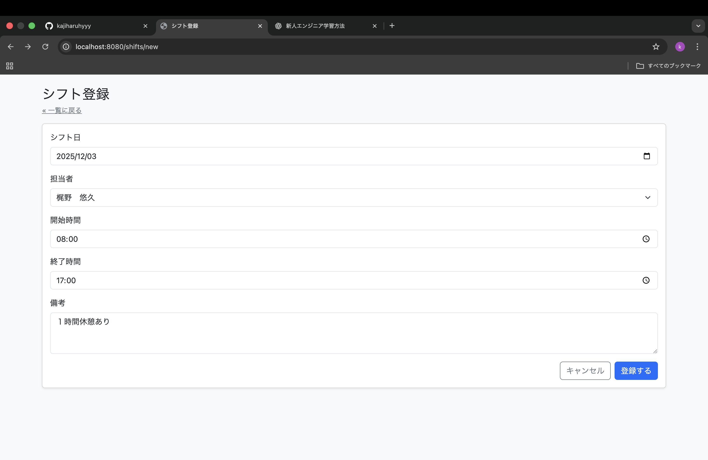
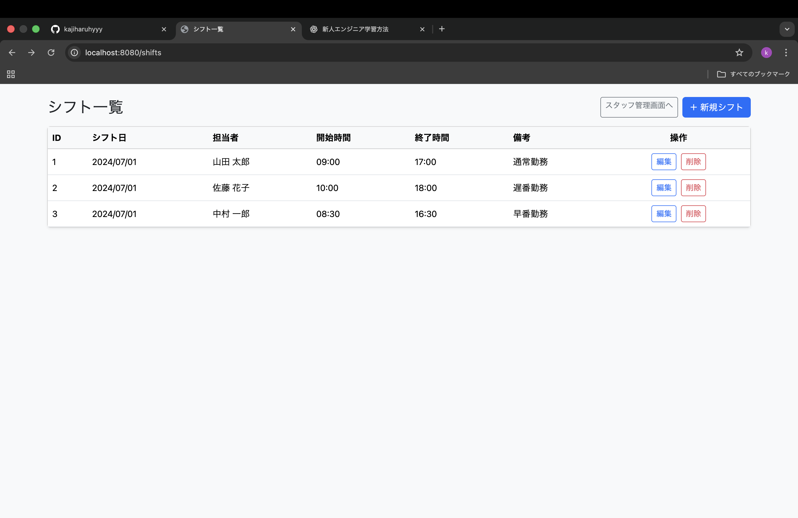
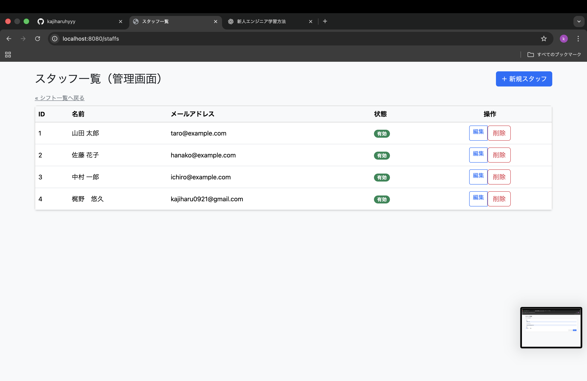
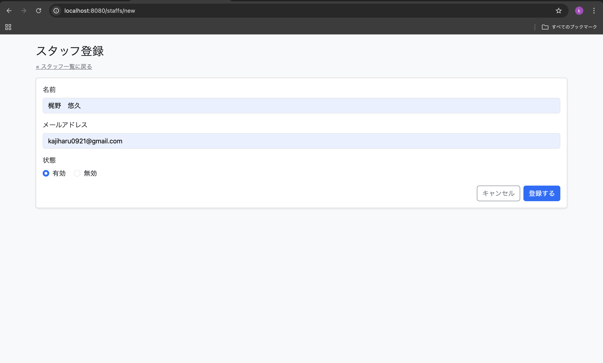

# TaskManager　— タスク管理ミニアプリ


## はじめに
ShiftManager は、社内メンバー向けのシンプルなタスク管理アプリです。
タスクの登録・編集・一覧表示ができ、担当者(メンバー)と紐付けて管理できます。

Spring Boot + Thymeleaf + H2 Database の構成で動作する学習用 Web アプリです。

チャットGPTに上司としてを投げてもらい作成しました。


---

## 機能


### シフト管理
- シフト一覧表示
- シフト新規登録
- シフト編集
- 勤務時間（h）の管理
- 担当者（Staff）との紐付け




### スタッフ管理
- スタッフ一覧
- スタッフの新規登録
- スタッフ編集
- スタッフ削除




---

## 技術スタック

- **Spring Boot 3.5.8**
- **Thymeleaf**
- **H2 Database**
- **Spring Data JPA / Hibernate**
- **Maven**
- **Java17**

---

### セットアップ
#### 1 Clone

```bash
git clone https://github.com/yourname/ShiftManager.git
cd TaskManager
```


#### 2 Run

``` bash
./mvnw spring-boot:run
```

#### 3 Access

``` bash
http://localhost:8080/shifts
```
---

## 学習したこと

- Spring MVC（Controller / Form / View）の一連の流れ
- CRUD 実装の基礎
- Bean Validation による入力チェック
- 多対一リレーション（Task → Member）
- H2 データ初期化（schema.sql / data.sql）
- Thymeleaf のフォームバインディング理解

---

## 今後の拡張予定

- ログイン・認可機能（Spring Security）
- シフト検索（担当者 / ステータス）
- 勤務時間レポート
- API 化（React フロント版）
- デプロイ（Render / Railway / AWS）

## 作者
**梶野　悠久**


